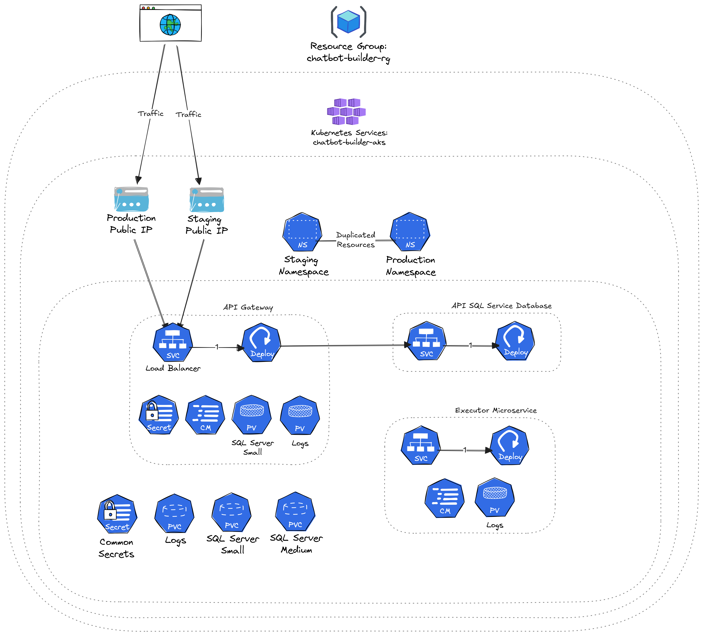

# Chatbot Builder Infrastructure

This repository is a setup for managing the infrastructure and deployment of chatbot builder system. It
uses **Terraform** for Azure infrastructure, **Kubernetes** for managing resources and nodes manifests, and
**GitHub Actions** for CI/CD to automate both infrastructure provisioning and application deployment.

---

## System Design

This is a high-level overview of the current system design for the chatbot builder infrastructure:



[Excalidraw Link](https://excalidraw.com/#json=nKa96yFUpwbaOKTvDROFr,ZHFaCVB7NeUnLwoQiUmeNw)

---

## Project Structure

The project is divided into two main sections: **Terraform** for infrastructure as code and **Kubernetes manifests** for
application deployment.

### 1. Terraform

Terraform code is organized under the `infra/` directory. It provisions the Azure Kubernetes Service (AKS) cluster and
related resources.

#### Modules

- `modules/resource_group`: An Azure resource group.
- `modules/aks`: Azure Kubernetes Service (AKS) cluster. It includes configurations for
  the number of nodes, VM size, and DNS prefix.
- `modules/public_ip`: Public IP addresses for the AKS cluster, one for the staging
  environment and another for the production environment.
- `modules/blob_storage`: Azure Blob Storage used by microservices to store files.

#### Outputs

- **Kubernetes Configuration:** The kubeconfig file for authenticating with the AKS cluster.
- **Public IPs:** The public IPs for the staging and production environments. They are already associated with the AKS
  cluster and used later to be injected into the Kubernetes manifests (Load Balancers).

#### Setup Instructions

- **Azure Credentials:**
  Before running Terraform, generate Azure credentials and save them in Terraform Cloud as environment variables:

    1. Create a service principal:
       ```shell
       az ad sp create-for-rbac --role="Contributor" --scopes="/subscriptions/<subscription_id>"
       ```
    2. Set the following environment variables in Terraform Cloud:
        - `ARM_CLIENT_ID`
        - `ARM_CLIENT_SECRET`
        - `ARM_SUBSCRIPTION_ID`
        - `ARM_TENANT_ID`
    3. For the Azure Blob Storage Account you need to get the account name and key manually from Azure Portal.
       Save them in the `common-secrets.yaml` manifest before applying it to AKS later:
        - `AZURE_BLOB_STORAGE_ACCOUNT_NAME`
        - `AZURE_BLOB_STORAGE_ACCOUNT_KEY`
        - `AZURE_BLOB_STORAGE_CONTAINER_NAME` for which you can use the default container `default-container`
    4. The OpenAI Service produces two outputs which should be saved in the `common-secrets.yaml` manifest:
        - `OPENAI_ENDPOINT`
        - `OPENAI_KEY` you can display this sensitive information using the following command:
        ```bash
        terraform output openai_key
        ```

- **Terraform Cloud:**
  This project is synced with Terraform Cloud for state management. Ensure you have a Terraform Cloud token saved as a
  GitHub secret (`TFC_TOKEN`) to authenticate and run Terraform commands in workflows.
  The token will be used to authenticate with Terraform Cloud and fetch the outputs for Kubernetes configuration and
  public IPs.

---

### 2. Kubernetes Manifests

The Kubernetes manifests are located in the `manifests/` directory and use **Kustomize** for managing different
environments (staging and production).

#### Directory Structure and Execution Flow

- `base/`: Contains the foundational Kubernetes manifests that define the core components of the application. These
  manifests are applied sequentially in the following order:
    - `pre-deployment/`: Includes **ConfigMaps** and **PersistentVolumeClaims (PVCs)** required before deployments.
    - `deployment/`: Includes **Deployment**, **StatefulSets**, and **DaemonSets**.
    - `post-deployment/`: Includes **Services**, **Ingress**, and **Network Policies**.
- `overlays/`: Contains environment-specific customizations for staging and production.
  Based on the deployment type:
    - Staging resources are applied in the **staging** namespace.
    - Production resources are applied in the **production** namespace.
- `secrets/`: Contains templates for Kubernetes secrets.

#### Deployment Notes

Once the Terraform infrastructure is deployed for the first time, the following resources must be applied manually to
Azure:

1. **Namespaces:** The `namespaces.yaml` file must be applied to create the required namespaces (`staging` and
   `production`).
2. **Secrets:** Populate the secret templates in the `manifests/secrets/` directory with actual values, then apply them
   manually.

These resources are essential for the Kubernetes environment to function properly and must be set up before automating
deployments.

---

## CI/CD Workflow

The repository includes two GitHub Actions workflows:

### 1. Deploy Terraform Infrastructure

This workflow runs on any push to the `infra/` directory or when triggered manually. It handles the provisioning of
Azure resources.

#### Key Steps:

1. **Terraform Initialization:** Initializes Terraform in the `infra/` directory.
2. **Validation:** Validates the Terraform configuration.
3. **Apply Changes:** Applies changes automatically if the branch is `main`.
4. **Output Values:** Saves the Terraform outputs (e.g., public IPs, Kubernetes configuration) for use in deployments.

Once Terraform is deployed, it outputs the following critical information:

- **Kubernetes Configuration:** Used to authenticate with the AKS cluster.
- **Public IPs:** Staging and production IPs for load balancers.

This information is stored in Terraform Cloud and automatically fetched during the deployment workflow.

### 2. Deploy Kubernetes Manifests

This workflow is triggered via a repository dispatch event (`deploy_chatbot_staging` or `deploy_chatbot_production`). It
deploys the Kubernetes resources to the specified namespace (staging or production).

#### Key Steps:

1. **Retrieve Terraform Outputs:** Fetches the public IPs and Kubernetes configuration using Terraform outputs.
2. **Update Kubernetes Context:** Generates a kubeconfig file from Terraform outputs to authenticate with the AKS
   cluster.
3. **Determine Namespace and Overlay:** Determines the environment (staging or production) and sets the appropriate
   overlay.
4. **Update Resources:**
    - Replaces the load balancer IP in the service manifests with the IP retrieved from Terraform outputs.
    - Updates the container image in the deployment manifests with the image name passed in the dispatch event payload.
5. **Apply Resources:** Applies the Kubernetes resources to azure.
